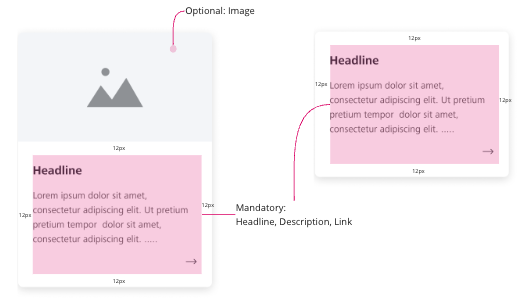

# ZEISS Interview Task

Welcome to the ZEISS frontend interview task :)
The objective of this coding task is to work on developing a component library mirroring our daily work
in the Beyond for Online Experience team.

## Requirements

As a developer working on the building a component library, I would like to add a `Card` component to the existing
[`React` | `Angular`] frontend library which can be used by product teams in their web applications.

### Scenario
2 product teams have requested the component library team for a `Card` component to be integrated into
their web applications. The teams have provided the following designs to serve as a reference point:




`Tasks`

- [ ] Pick a framework of your choice: React or Angular
- [ ] Plan and implement component(s) based on the above design requirements. NOTE: it is NOT necessary to fully implement all functionalities. Please focus on general structuring of the component(s).
- [ ] Test the developed component

***Note:*** There are `TODOs` setup in the codebase to serve as guidance.

## Prerequisites

Download or clone the repository.

### Installing project dependencies 

To install the project dependencies, run the installation command as shown below:

```sh
npm i
```

### Running the project and required scripts

#### Storybook

The project has 2 libraries setup: `ui-angular` and `ui-react`. To run the library of your choosing, run the
following commands:

```sh
nx storybook ui-angular
```

```sh
nx storybook ui-react
```

Each library is meant to mirror a component library written in either `Angular` or `React`.
Both libraries have been pre-configured with `Storybook` to render the components to be implemented during
the live coding task. Running the above scripts will start the Storybook instance locally.

#### Tests

Unit tests:

```sh
nx test <ui-angular|ui-react>
```

Storybook tests:

```sh
nx test-storybook <ui-angular|ui-react>
```

#### Build

```sh
nx build <ui-angular|ui-react>
```

## Configuring IDEs

Have a look at the [Nx Console extensions](https://nx.dev/nx-console). It provides autocomplete support, a UI for exploring and running tasks & generators, and more! Available for VSCode, IntelliJ and comes with a LSP for Vim users.

✨ **This workspace has been generated by [Nx, Smart Monorepos · Fast CI.](https://nx.dev)** ✨
